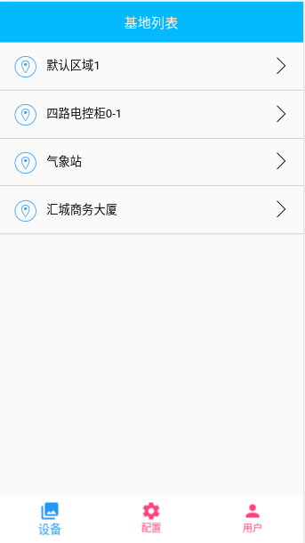
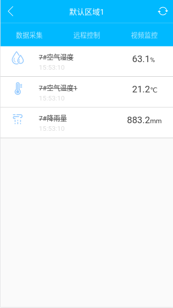
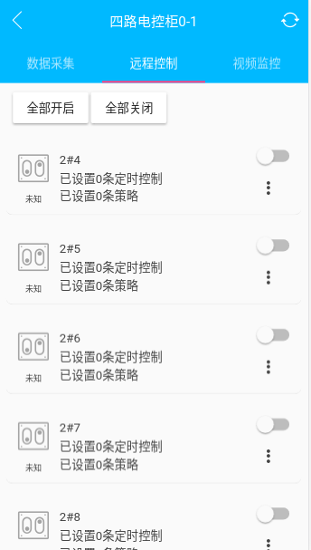
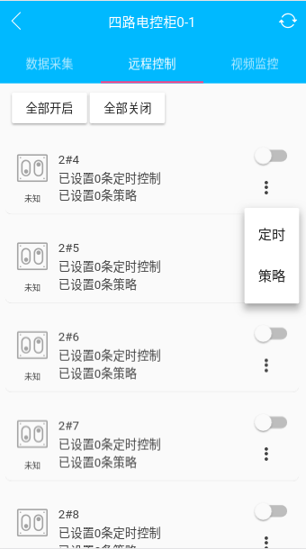
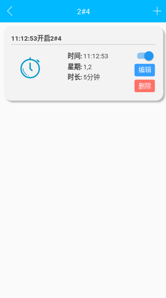
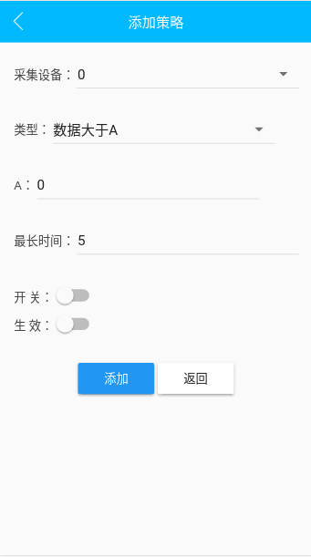
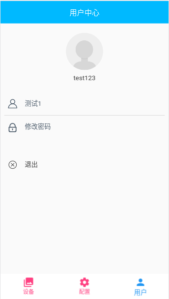
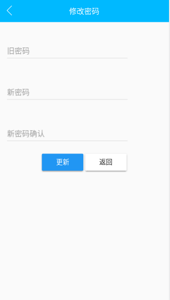

# 智慧农业APP使用手册

## 1. 登录

打开手机`app`，进入登录页面。

## 2. 设备监控

### 1. 基地列表

登录成功后，进入基地列表界面，如下图。在该页面可以看到基地的名称，用于设备的分类管理。

### 2. 采集设备

根据自己的实际需要，点击*基地列表*中具体一项，进行相关的设备管理界面，如下图。

进入基地之后，可以看到该基地下相关的设备数量统计。点击相应的设备进入相关的设备监控，首先我们进入采集设备的监控（点击采集设备）。在采集页面下可以看到传感器的相关数据。如果传感器的名称被中划线划掉，则说明设备***掉线***（如下图，三个设备全部掉线）。

### 3. 控制设备（开关设备）

点击远程控制，页面就跳转到控制设备页面，如下图。

1. 该页面显示开关设备的列表，点击最右边的开关按钮，就可以对设备进行控制。
2. 点击最上方的全部开启/全部关闭，可以实现改基地下的全部设备开启/关闭。（开启时间比较长，需要您手动刷新）
3. 同时您也可以为设备添加定时和策略。点击开关按钮下方的图标，可以进行相关的配置页面。

### 4. 开关设备定时配置

1. 点击开关按钮下方的图标，展现出定时和策略的列表（如左图），点击定时，进入定时配置页面（如右图）。

2. 现在改页面没有相关定时的配置信息，点击右上方的`加号`。进入添加定时页面。

3. 按照要求填写相关的数据，点击***添加***按钮，添加成功会自动返回到定时页面。
    	1. 循环方式：一个星期生效的日期
    	2. 开启时间：定时生效的时间
    	3. 最长时间，开关开启的最长时间，开关开启超过改时间会自动关闭。（关闭无效）
    	4. 开关：设备的相关动作。
4. 添加完定时之后，可以在列表中看到定时的配置信息。

### 5. 开关设备策略配置

点击***策略***，进入策略页面。策略是根据传感器的数据，判断开关是否开启/关闭。

同配置定时，点击右上方的*加号*，进入添加策略的页面。填写相关的数据，点击添加提交。

1. 采集设备：选择需要监控的传感器
2. 类型：触发的类型
3. A:传感器临界值
4. 最长时间，开关开启的最长时间，开关开启超过改时间会自动关闭。（关闭无效）
5. 开关：设备的相关动作。
6. 生效：是否工作。

## 3. 用户信息

### 1. 修改密码

进入主页，点击底部导航栏的***用户***。可以看到用户的相关信息，点击修改密码，进入密码修改页面。

