# 智慧农业PC WEB使用手册

## 一 概述

### 1. 功能介绍

- 设备监控
- 基地管理
- 配置中心：网关配置、添加定时、添加策略
- 设备触发器
- 设备报表：设备日报表、设备月报表
- 用户中心
- 系统管理：用户管理、角色管理、公司信息

### 2. 运行环境

​	本平台推荐运行在谷歌浏览器上，尽量不要使用IE浏览器。本操作手册以谷歌浏览器为例进行讲解。

## 二 基本介绍

### 2.1 平台登录

1. 打开浏览器，在地址栏中输入[http://cloud.sciento.top](http://cloud.sciento.top)登录智慧农业种植平台，如果想以中性模式运行请联系管理员进行配置。登录界面如下图：

   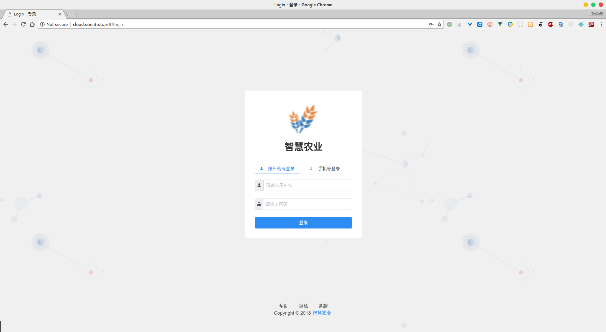

### 2.2 首页介绍

如图，页面由三部分组成，包括左边的菜单栏，顶部的状态栏和展示栏。在主页中，展示以下几个功能。

 - 设备数量

 - 采集设备的数据

 - 采集设备的地理位置

   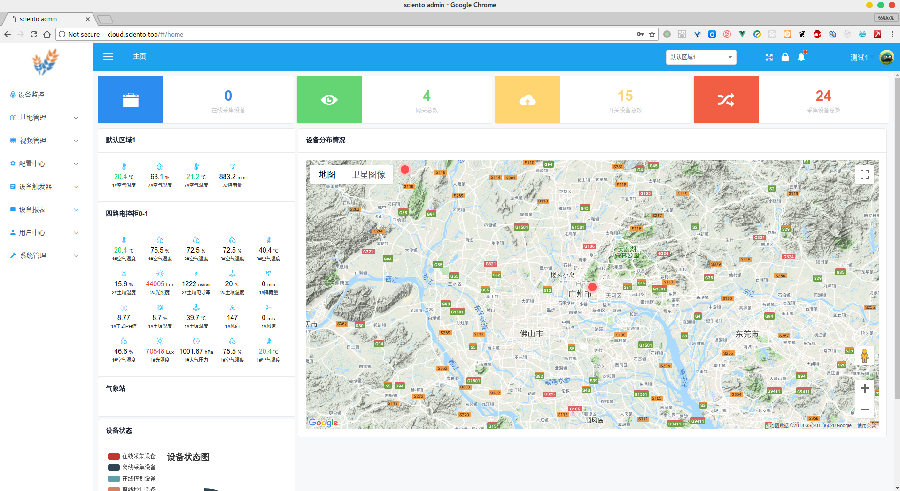

### 2.3 操作流程

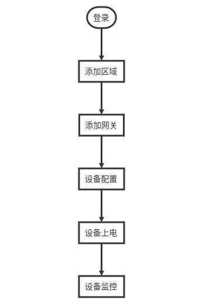

<!--
```flow
st=>start: 登录
e=>end
area=>operation: 添加区域
gateway=>operation: 添加网关
deviceconfig=>operation: 设备配置
devicelink=>operation: 设备上电
deviceview=>operation: 设备监控

st->area->gateway->deviceconfig->devicelink->deviceview
```
-->


## 三 操作说明

### 3.1 基地管理

如果您是刚刚使用本平台，第一步是添加基地。在左边的菜单栏中选中***基地管理>基地管理***，显示基地列表，如下图。

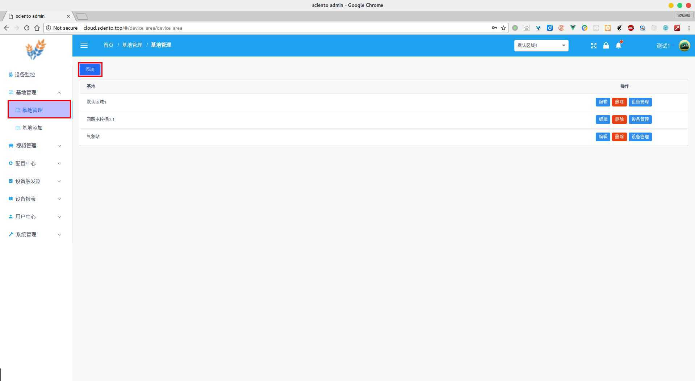

用户可以点击***添加***，进入添加基地的页面，如下图。输入基地的名称，点击添加基地就添加基地成功，页面自动返回到基地列表页面。

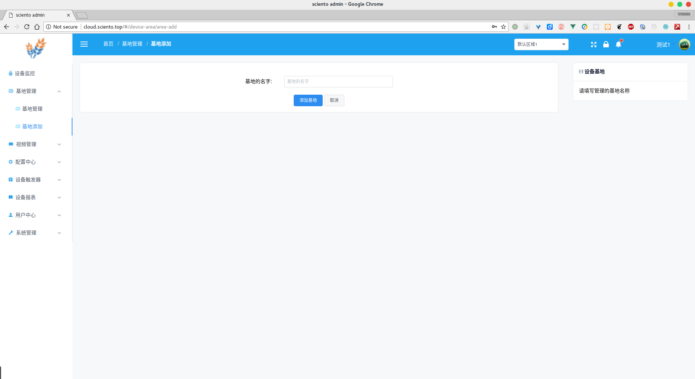

### 3.2 网关管理

点击**配置中心>网关管理**，就进入网关列表页面，如下图，在页面您可以看到网关的相关信息。点击**添加**按钮,进入添加网关的页面。

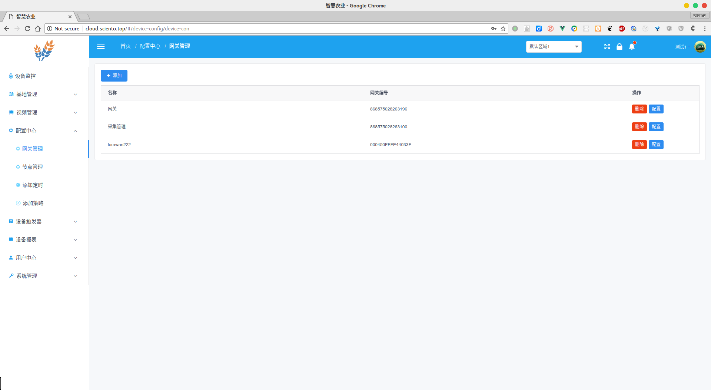

在网关添加的页面，需要添加相关的数据，其中有几个重要的参数：

1. 名称：名称的长度必须超过8
2. 网关类型：网关类型主要分为赛通网关和`Lorawan`网关，根据自己购买的产品添加
3. 网关编号：赛通网关的编号通过上位机获取（**注意：是比较长的编号**），`Lorawan`网关在设备的外壳标签上。

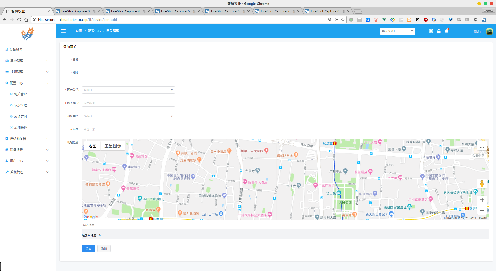

### 3.3 设备管理

一般情况添加网关之后，设备配置后在设备监控页面就可以看到相关的设备，如果您想直接配置设备的参数，可以进入**基地管理**，在需要进行设备管理的基地上点击**设备管理，**如下图。

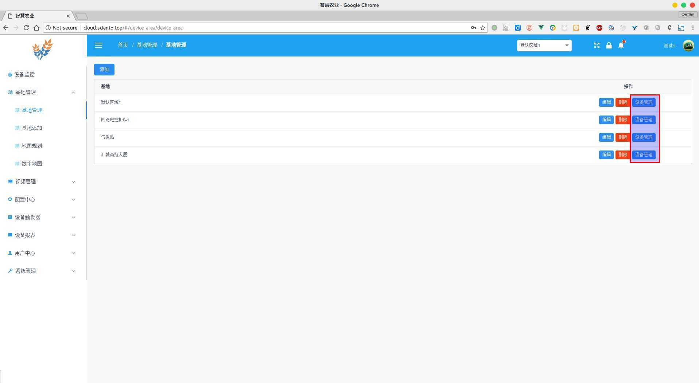

这样就能看到采集设备和开关设备的列表，设置就可以对设备进行相关配置。

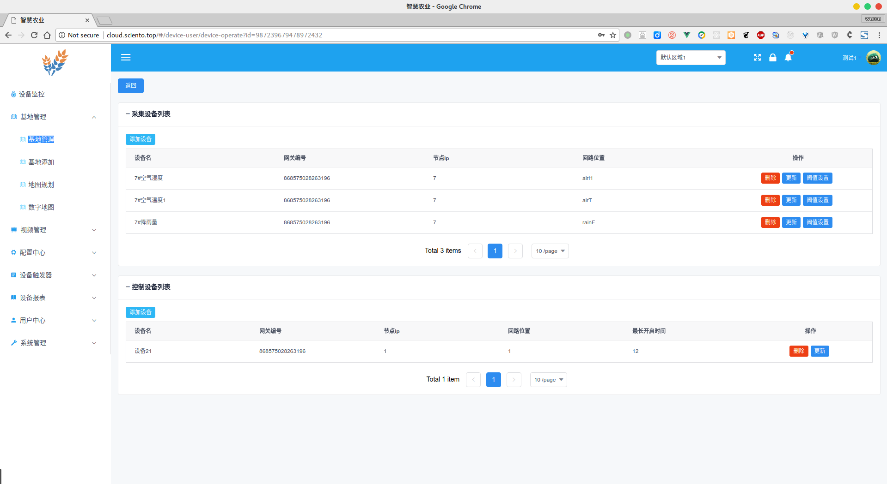

### 3.4 设备监控

点击**设备监控**进入传感器监控和设备控制页面，如下图。

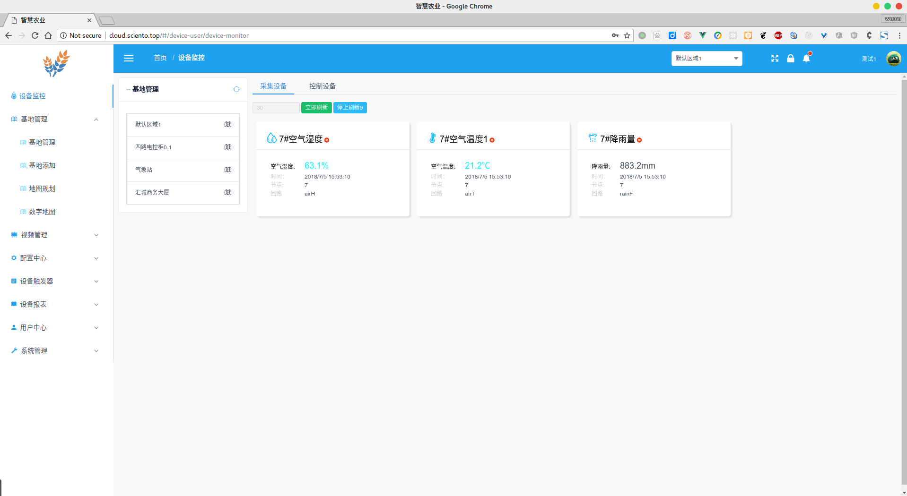

### 3.5 设备定时和策略

在**设备监控**页面在Tab中点击**开关设备**可以看到开关设备状态列表。

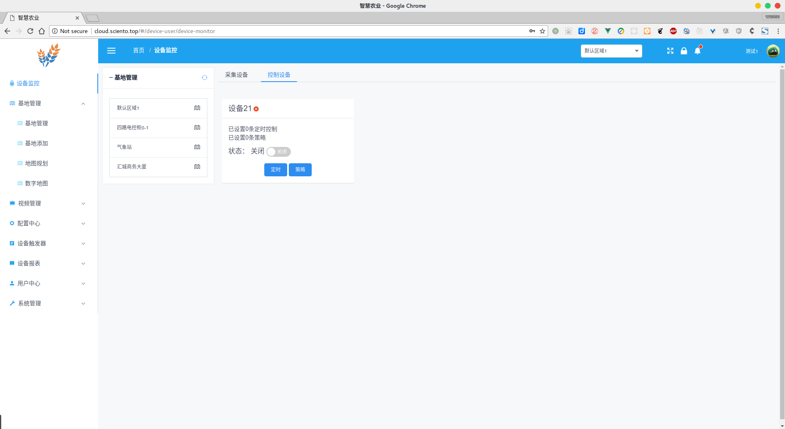

1. 点击**定时**，进入定时配置的页面
2. 点击**策略**，进入策略配置的页面

## 四 系统管理

### 4.1 角色管理

该平台可以添加其他的用户，每个用户需要有一个与他权限相关的角色，因此，如果您还没有角色，您需要添加角色。点击***系统管理>角色管理***进入角色列表页面，点击**添加**按钮，弹出添加角色的对话框，如下图。

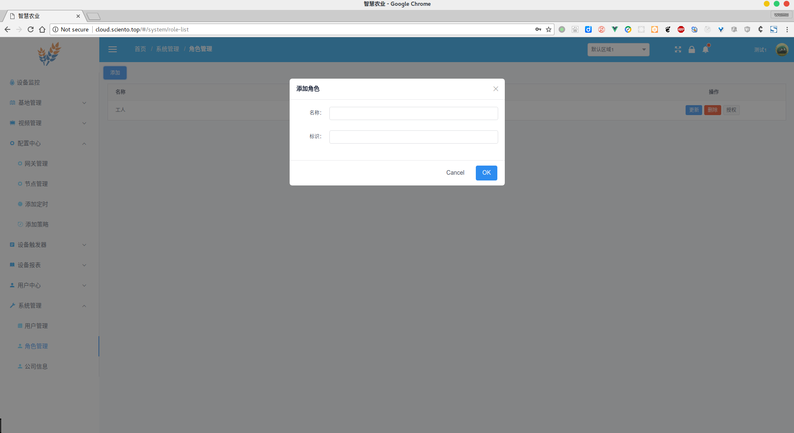

添加角色后，就可以在列表中看到刚刚添加的角色。然后我们就需要给角色分配相关的权限。点击需要授权角色行上的**授权**按钮，此时进入授权页面，如下图。

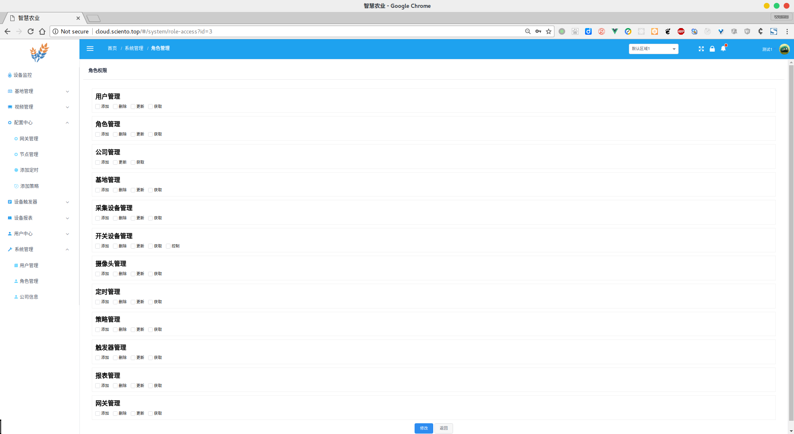

根据自己的需求选择相关的权限，点击**修改**保存修改。

### 4.2 用户管理

点击***系统管理>用户管理***进入用户列表页面。点击**添加**进入用户添加页面，如下图。

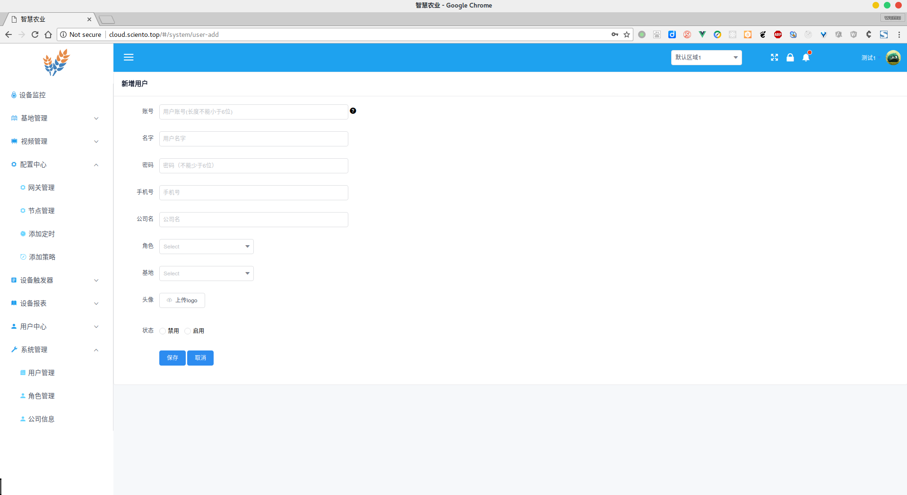

用户表单中有几个重要的参数需要配置：

1. 账号：长度必须大于6，如果这个不填默认手机号作为账号
2. 名字：必填
3. 密码：长度不得少于6
4. 手机号：必填，不能为电话号码
5. 角色：选择相关的角色，必填。
6. 基地：如果添加基地，用户在监控页面只能看到次基地下的设备，反之可以看到所有设备。

### 4.3 公司信息

点击***系统管理>公司信息***可以进行公司信息的配置，如下图。

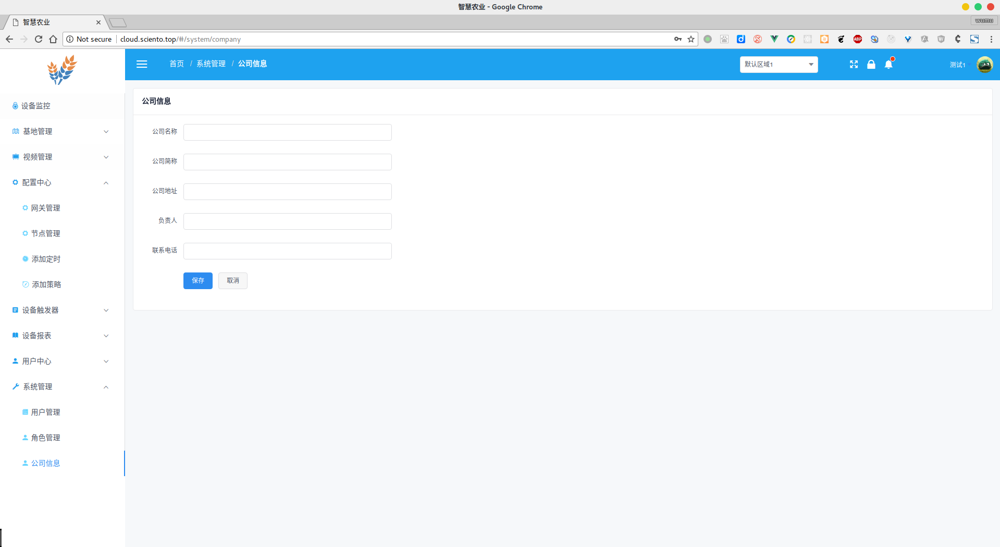